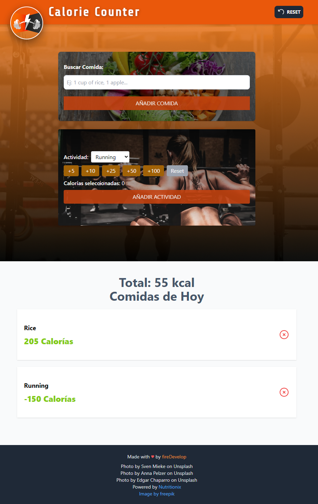

<div align="center">
  <a href="README.md">English</a> | <a href="README.es.md">Español</a>
</div>

<div align="center">
  
  <h1 align="center">Calorie Counter</h1>
</div>

<p align="center">
  Una aplicación web moderna para llevar un registro diario de las calorías consumidas y quemadas.
</p>

<p align="center">
  
  
  
  
</p>

<p align="center">
  <a href="https://calorie-counter-api-usereducer.netlify.app/" target="_blank">
    
  </a>
</p>

## 📸 Captura de Pantalla



## 📝 Descripción del Proyecto

**Calorie Counter** es una aplicación web responsiva que permite a los usuarios llevar un control de su ingesta calórica y su gasto energético a través del ejercicio. La aplicación calcula automáticamente el balance calórico neto, ofreciendo una visión clara del progreso diario.

El estado de la aplicación se gestiona de forma eficiente y robusta utilizando los hooks `useReducer` y `useContext` de React, lo que garantiza un flujo de datos predecible y escalable. Además, los datos se guardan en el `localStorage` del navegador para persistir la sesión del usuario, mejorando la experiencia de uso.

## ✨ Características Principales

- **Registro de Actividades:** Añade comidas y ejercicios con sus respectivas calorías.
- **Cálculo en Tiempo Real:** Visualiza al instante las calorías consumidas, quemadas y el balance neto.
- **Edición y Eliminación:** Modifica o elimina cualquier registro con un solo clic.
- **Persistencia de Datos:** La información se guarda en `localStorage` para que no pierdas tu progreso al cerrar el navegador.
- **Reinicio Fácil:** Opción para borrar todos los datos y empezar de cero.
- **Diseño Responsivo:** Interfaz totalmente adaptable a dispositivos móviles y de escritorio, construida con Tailwind CSS.

## 🚀 Tecnologías Utilizadas

- **Framework:** React con Vite
- **Lenguaje:** TypeScript
- **Estilos:** Tailwind CSS
- **Gestión de Estado:** React Hooks (`useReducer`, `useContext`)
- **Iconos:** Heroicons
- **IDs Únicos:** `uuid`

## 🛠️ Instalación y Puesta en Marcha

Sigue estos pasos para ejecutar el proyecto en tu entorno local:

1. **Clona el repositorio:**
   ```bash
   git clone https://github.com/firedevelop/calorieCounterAPI.git
   ```

2. **Navega al directorio del proyecto:**
   ```bash
   cd calorieCounterAPI
   ```

3. **Instala las dependencias:**
   ```bash
   npm install
   ```

4. **Ejecuta el servidor de desarrollo:**
   ```bash
   npm run dev
   ```
   La aplicación estará disponible en `http://localhost:5173` (o el puerto que indique Vite).


## 📄 Créditos

- Hecho con ❤️ por [fireDevelop](https://github.com/fireDevelop).
- Imágenes de fondo por [Sven Mieke](https://unsplash.com/@sxoxm), [Anna Pelzer](https://unsplash.com/@annapelzer) y [Edgar Chaparro](https://unsplash.com/@echaparro) en Unsplash.
- Logo por [freepik](https://www.freepik.com/free-vector/fitness-center-logo-design-template_35897801.htm#fromView=keyword&page=1&position=19&uuid=bd785584-eadb-4377-aaf0-1e9f224df9d0).
- Powered by [Nutritionix](https://www.nutritionix.com/).

## 🆔 Project ID
id0000569